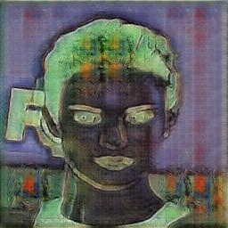
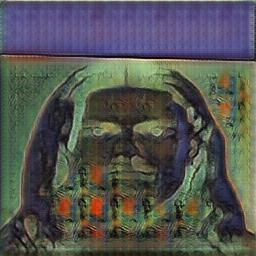
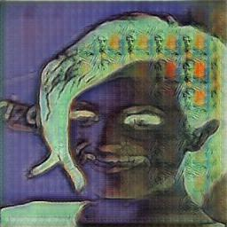
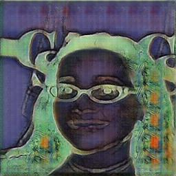
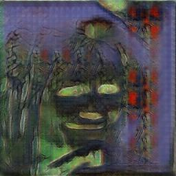
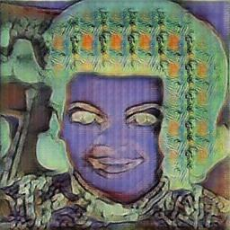

# Introduction to Deep Learning: Final Project
## Introduction
During this class, we touched upon many topics in the field of Deep Learning, and learned about neural networks, stochastic gradient descent, and other techniques and approaches to applying Deep Learning to real world problems.

The subject that I was - and still am - most excited by was last week's module on Generative Adversarial Networks (GANs). In particular, the ability for a generator and discriminator to work together to "learn" the style of source material. For the Final Project, I wanted to apply that knowledge gained more in-depth to another area of art. Both as a means to better understand how to develop GANs, as well as to explore the fun - and often surprising - output of these systems.

My Final Project will be to train a GAN on the data of an artist, in this case [Pablo Picasso](https://en.wikipedia.org/wiki/Pablo_Picasso), a painter whose [cubist](https://en.wikipedia.org/wiki/Cubism) style popularized an entirely new approach and way of thinking about art.

Specifically, I have always been fond of Picasso's attempts at portraits, which is where I think cubism really shines. Therefore, **the goal of my Final Project will be to train a GAN on a collection of Picasso's art, in order to produce a model which can transform photos of people's faces into a cubist style.**

The code for this project can be found at: https://github.com/buffs28349/IntroDeepLearningFinalProject

In order to improve training time, and get more experience using GPUs, I would suggest running this notebook on [Google Colab](https://colab.research.google.com/), a platform for running Jupyter Notebooks in your browser, targeted towards scientific computing and collaboration. You can find a link to this notebook on Colab here: https://colab.research.google.com/drive/1WsVF43K9L31k3GEiRUgYJXGRQLUXGdti?usp=sharing

A zip file of the collection of Picasso generated GAN portraits can be found at this Google Drive link: https://drive.google.com/file/d/1B-i7GaSIUSmosu11pRRvvD8WBPkdPkqh/view?usp=sharing

First, let's begin by importing the necessary libaries:

## Samples
In addition to the zip file on Google Drive above, here are a half-dozen samples collected from the total output:

